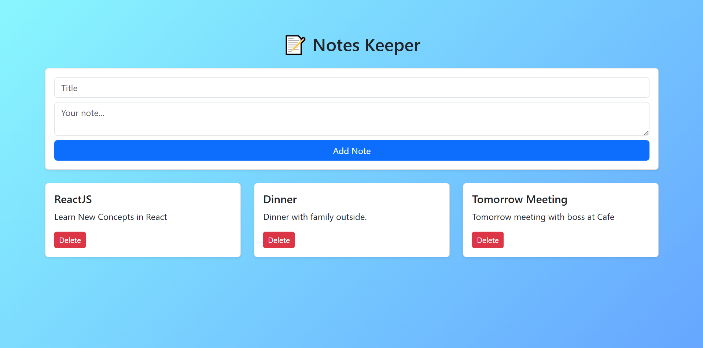

# 📝 Notes Keeper – React App

A simple and elegant note-taking app built with **React** and **Bootstrap**.  
Easily add, display, and delete notes with a clean user interface.  

<br>

## 📸 Screenshots



<br>

## 🚀 Features

- 🧠 Add and manage notes
- 🗑️ Delete individual notes
- 📋 Form with validation
- 🎨 Clean Bootstrap styling
- ⚡ Fully responsive layout

<br>

## 🛠️ Tech Stack

- React
- Bootstrap
- JavaScript
- CSS

<br>

## 🔧 How to Run

```bash
git clone https://github.com/Mubeen-Channa/Notes-Keeper-In-React.git
cd notes-keeper-react
npm install
npm run dev
